# 🌿 SmartLeaf: Mildew Detection in Cherry Leaves

## 📌 Project Summary

SmartLeaf is a machine learning-powered solution designed to automatically classify cherry leaves as **healthy** or affected by **powdery mildew**. This tool provides real-time predictions and visual analytics via an interactive dashboard to support plant pathologists, farmers, and agricultural scientists in rapid diagnosis and intervention.

---

## 🌟 Project Objective

> **Predict whether a given cherry leaf image is healthy or affected by powdery mildew.**

This includes building a complete ML pipeline and a dashboard that allows:

* User-uploaded image classification
* Visual explanations of what the model has learned
* Clear performance metrics
* A user-friendly experience tailored for agricultural stakeholders

---

## 🔍 CRISP-DM Process Breakdown

### 1. Business Understanding

* Identified the need for automated mildew detection
* Defined KPIs (target accuracy of ≥ 70%)
* Chose a CNN model for binary image classification
* Defined user stories to clarify functional requirements:

  * As a user, I want to upload a cherry leaf image so I can get a health diagnosis.
  * As a user, I want to view visual differences between healthy and infected leaves.
  * As a user, I want to see how confident the model is in its prediction.
  * As a stakeholder, I want to evaluate the model’s performance.

### 2. Data Understanding

* Dataset from Kaggle: [codeinstitute/cherry-leaves](https://www.kaggle.com/codeinstitute/cherry-leaves)
* Two classes: `healthy` and `powdery_mildew`
* All images are RGB and roughly 256x256 pixels
* Visualized:

  * Class distribution
  * Image dimensions
  * Sample images
  * Average images per class and their absolute differences

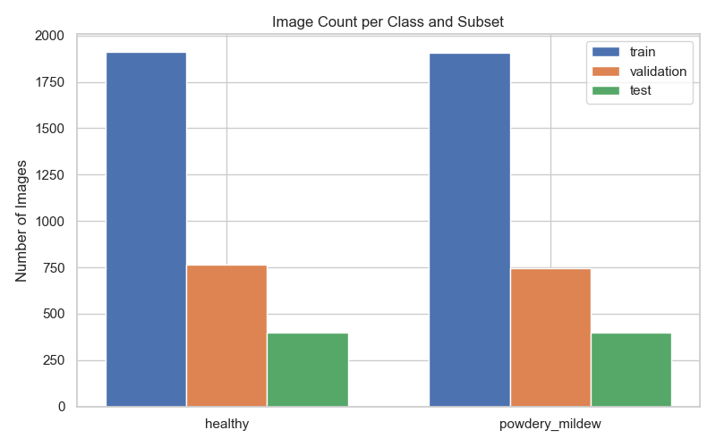

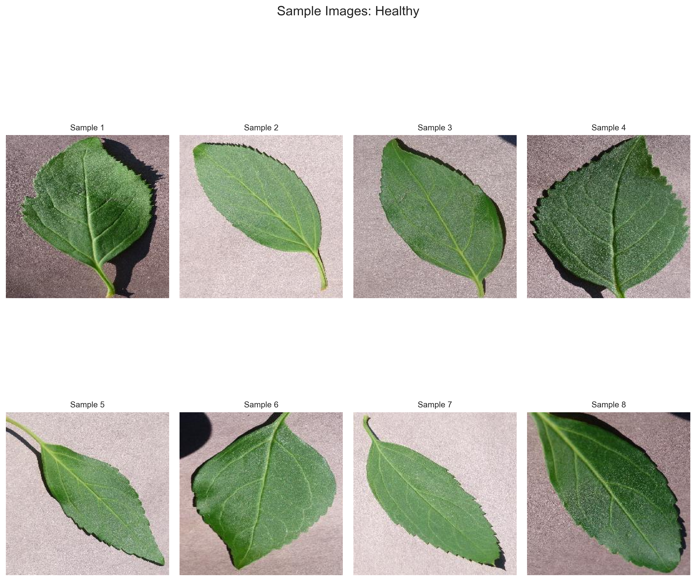
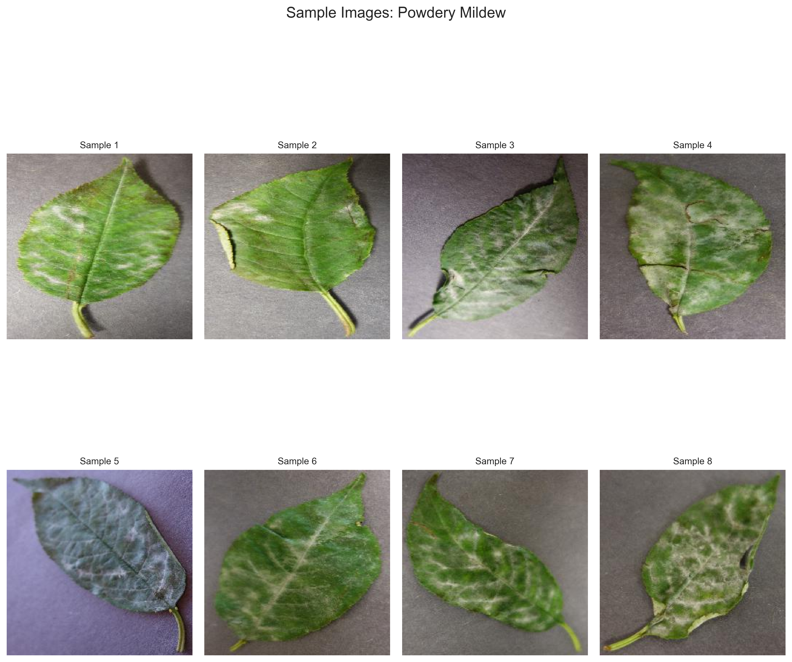
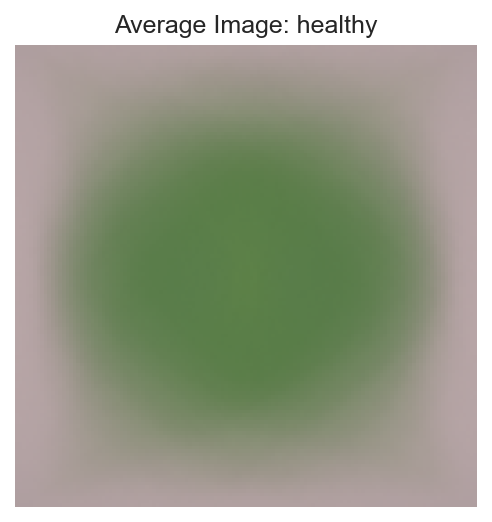
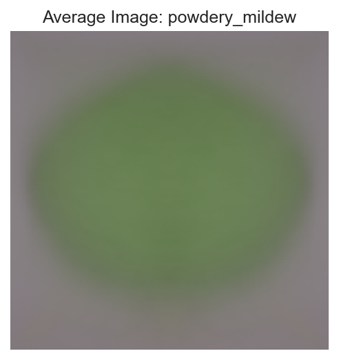
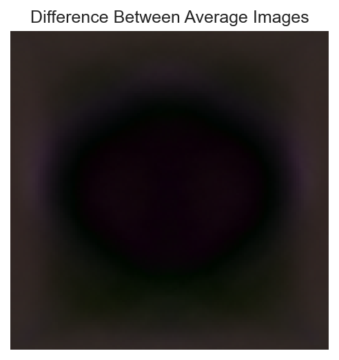

### 3. Data Preparation

* Validated and removed corrupted images
* Split dataset into train/validation/test (70/20/10)
* Augmented training images (rotation, shift, zoom, flip)
* Saved all outputs in structured folders for reproducibility

### 4. Modeling

* Built a CNN with:

  * 3 Convolutional layers
  * GlobalAveragePooling
  * Dense and Dropout layers
* Compiled with Adam optimizer and binary crossentropy
* Applied EarlyStopping and ModelCheckpoint
* Achieved over **99% accuracy**
* Saved model as `mildew_model.h5`

### 5. Evaluation

* Loaded model and training history
* Visualized training/validation accuracy and loss
* Plotted confusion matrix and classification report
* Computed precision, recall, F1-score, AUC
* Visualized:

  * ROC Curve
  * Predicted vs actual class on random samples
  * Model complexity (parameter summary)

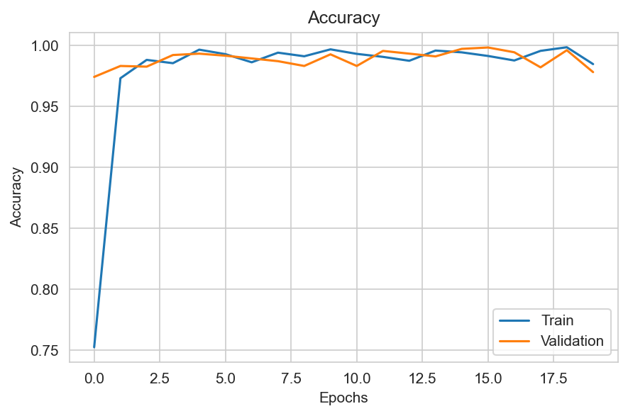
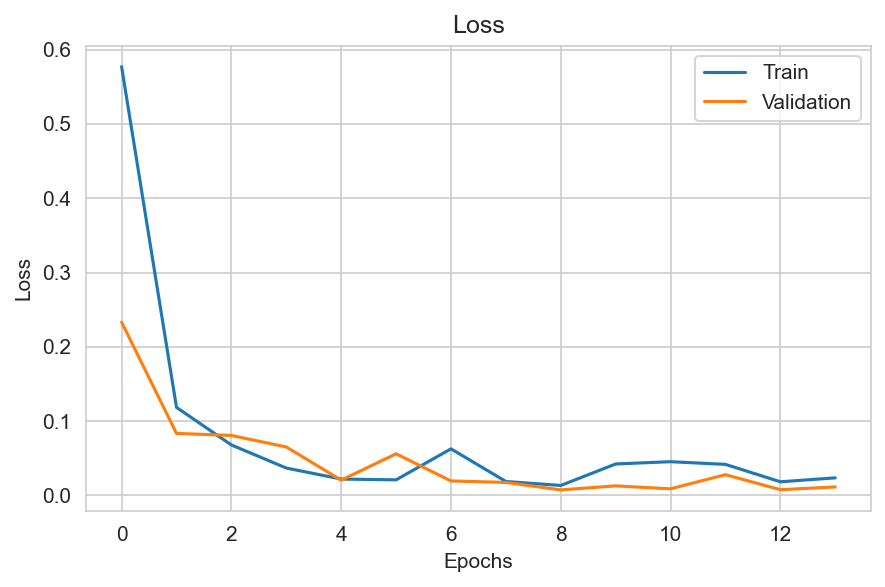
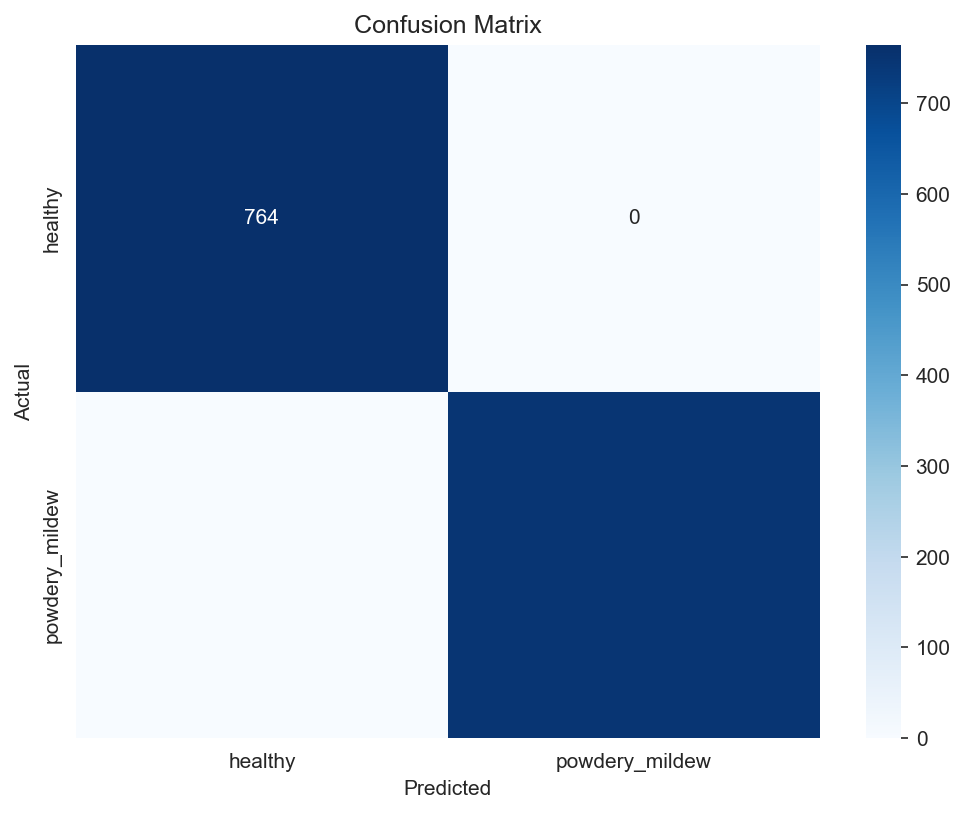
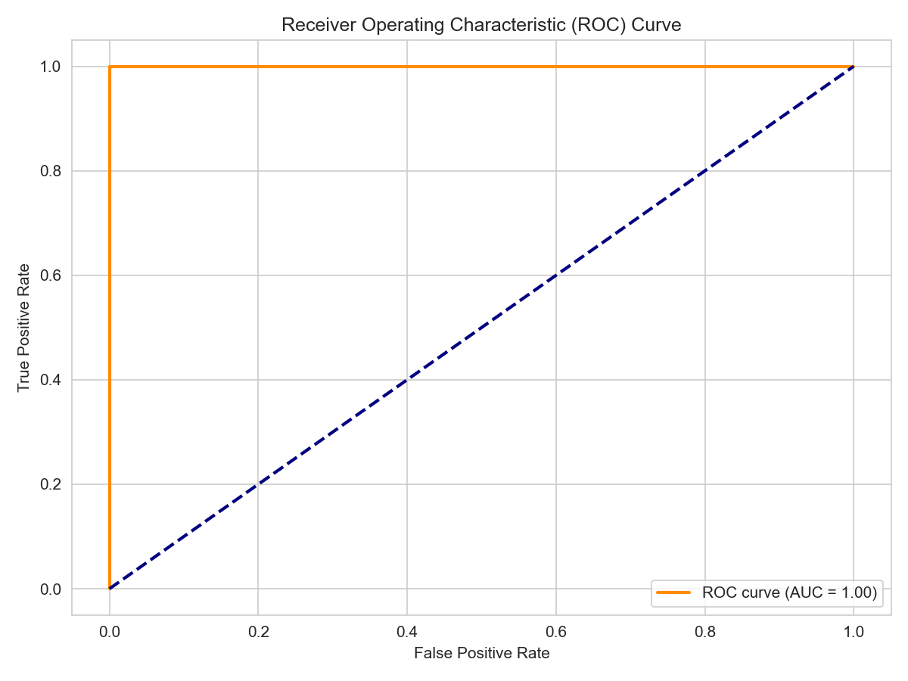
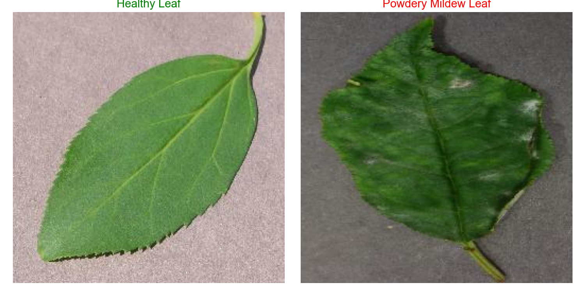


### 6. Deployment

* Developed Streamlit dashboard with modular pages
* Tabs: Predict | Visual Study | Model Performance | Business Impact | About
* Supports image upload, live prediction, class visualization, and performance summary
* Dashboard designed with user feedback and interpretability in mind

---

## 📂 Project Structure

```
mildew-detection-project/
├── app.py                        # Main Streamlit app
├── requirements.txt              # Dependencies
├── Procfile                      # Heroku deployment
├── runtime.txt                   # Python version
├── setup.sh                      # Heroku setup script
├── README.md                     # Project documentation
├── app_pages/                    # Streamlit modular pages
│   ├── page_summary.py
│   ├── page_visual_study.py
│   ├── page_ml_performance.py
│   ├── page_business_impact.py
│   └── page_hypothesis.py
├── src/                          # Supporting modules
│   ├── data_management.py
│   ├── utils.py
│   └── machine_learning/
│       ├── evaluate_clf.py
├── jupyter_notebooks/            # Analysis notebooks
│   ├── 01_DataCollection.ipynb
│   ├── 02_DataVisualization.ipynb
│   ├── 03_DataCleaning.ipynb
│   ├── 04_DataPreprocessing.ipynb
│   ├── 05_Modeling.ipynb
│   └── 06_ModelEvaluation.ipynb
├── inputs/                       # Raw and split data
│   └── cherry-leaves/
└── outputs/                      # Models, plots, and reports
    ├── mildew_model.h5
    ├── training_history.pkl
    ├── history.json
    ├── class_indices.json
    ├── performance_summary.json
    ├── model_summary.json
    ├── plots/
    │   ├── confusion_matrix.png
    │   ├── confusion_matrix.json
    │   ├── model_training_accuracy.png
    │   ├── model_training_losses.png
    │   ├── avg_healthy.png
    │   ├── avg_mildew.png
    │   ├── abs_diff.png
    │   ├── healthy.png
    │   ├── mildew.png
    │   ├── healthy_vs_mildew.png
    │   └── roc_curve.png/json
```

---

## 🔍 Dashboard Features

### 🔍 Predict

* Upload a cherry leaf image
* View live prediction with confidence

### 📊 Visual Study

* Average images for each class
* Absolute difference between healthy and mildew
* Sample grid view of each class

### 📊 Model Performance

* Confusion matrix
* Classification report
* ROC Curve with AUC
* Parameter summary
* Live prediction samples with confidence levels

### ℹ️ About

* Business use case
* Model background
* Contributors

---

## 👤 Contributors

* **Project Lead & Developer:** \Isaac Aboagye
* **Guided by:** Code Institute Portfolio Project 5 Guidelines
* **Dataset Source:** [Kaggle - codeinstitute/cherry-leaves](https://www.kaggle.com/codeinstitute/cherry-leaves)

---

## 🚀 Deployment

To run locally:

```bash
pip install -r requirements.txt
streamlit run app.py
```

To deploy on Heroku:

* Ensure `Procfile`, `setup.sh`, `runtime.txt` are in place
* Use Heroku CLI or GitHub CI/CD

---

## 🎓 License & Usage

This project is for educational and demonstration purposes only. Please reference the dataset source if used in other applications.

---

## 📅 Last Updated

**May 2025**

---

For feedback or collaboration, please open an issue or contact the repository owner.
